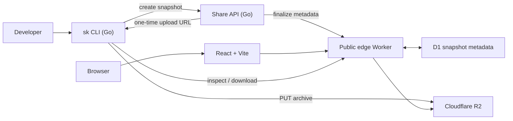

# Skilldrop — Architecture

## Decision summary

Skilldrop is a **snapshot transfer service**, not a package registry. `sk share`
turns one local skill directory into an immutable archive; `sk install` downloads,
inspects and installs that exact archive.

For the MVP, use:

- **CLI:** Go, built with Cobra (and Viper only if configuration is introduced).
- **Control API:** a small Go HTTP service.
- **Snapshot storage and delivery:** Cloudflare R2 behind a Cloudflare Worker.
- **Web:** a plain React application built with Vite and deployed statically.
- **Metadata store:** Cloudflare D1, accessed by the Worker. The Go API does not
  need direct database access in the initial design.

This keeps the command-line path portable and easy to distribute, while using
object storage and the edge for the parts they are naturally good at: immutable
files, redirects, caching and public download delivery.

## Product boundaries

The architecture intentionally does not implement a registry model:

- no global catalogue, search, profiles or discovery feed;
- no mutable package versions or dependency resolution;
- no required account, repository or Git integration;
- every upload is an independent immutable snapshot;
- a snapshot can expire, but it cannot be changed in place.

The public identifier is an opaque capability for an unlisted snapshot, not a
human-readable package name. A short random ID is convenient in URLs; it must
have sufficient entropy to make enumeration impractical.

## System overview



The Go service owns upload authorisation and validation of client-provided
metadata. The Worker owns public read behaviour. R2 owns archive bytes. This
separation means the public path can scale and cache independently of upload
traffic.

## Components

### `sk` CLI — Go

The CLI is the trusted implementation of the snapshot format and installation
rules. Its MVP commands are:

```text
sk list
sk share <name|path> [--expires <duration>]
sk inspect <url|id>
sk install <url|id> [--agent claude|codex|all] [--dry-run]
sk remove <name>
```

Use Cobra for command composition, help, flags and shell completion. Do not add
Viper until configuration persists beyond a single optional API base URL; when
it is needed, use it only for config-file and environment precedence, not for
command behaviour.

Responsibilities:

1. Resolve a named local skill from known agent directories or accept an
   explicit path.
2. Validate and walk the directory without following unsafe symlinks.
3. Produce a deterministic archive and manifest.
4. Calculate hashes before upload.
5. Request and use a single upload grant, then finalise the snapshot.
6. Fetch metadata before installation, display warnings and require explicit
   installation confirmation (unless a future `--yes` is deliberately added).
7. Verify archive and manifest hashes before extracting into an agent folder.

The CLI should be dependency-light, cross-compiled and released as a single
binary. The standard library provides `archive/tar`, `compress/gzip`,
`crypto/sha256`, HTTP and filesystem primitives; add dependencies only where
they improve UX materially.

### Share API — Go

The API is deliberately small and stateless. It can run as a container on
Cloud Run, Fly.io, Render, a small VM, or eventually a Cloudflare Worker if
keeping Go operationally is not worthwhile. Its initial responsibilities are:

- validate a proposed manifest against server-side policy;
- allocate an opaque snapshot ID;
- issue a short-lived, single-purpose R2 upload URL;
- accept finalisation only after the archive object exists;
- register public metadata with the Worker/D1 read model.

The API must never unpack or execute an uploaded archive synchronously. It
trusts no file path supplied by the client: policy checks are repeated by the
download client and, later, by asynchronous server-side scanning if needed.

### Public Worker — TypeScript

The Worker is a thin read layer, not the core domain service. It should:

- resolve `/s/:id` metadata;
- serve the raw `SKILL.md` for the MVP, respecting the product scope;
- expose machine-readable metadata and the archive download endpoint;
- enforce expiry and snapshot state;
- stream archive bytes from R2 with immutable cache headers;
- return the React app for the post-MVP formatted preview.

It accesses D1 and R2 through native bindings. Keeping the Worker narrow makes
it easy to replace its implementation or move metadata to another store later.

### Web — React + Vite

The website is a static Vite build. Its marketing pages can be hosted on
Cloudflare Pages or Vercel. Snapshot pages call the public Worker API; they do
not call the Go service directly.

MVP behaviour follows the current scope: `/s/:id` returns raw `SKILL.md`.
The React preview is post-MVP. At that point, browser routing can render a
formatted view while `Accept: text/plain`, `curl`, and the CLI receive a stable
raw/JSON interface.

## Snapshot format

An uploaded snapshot is a gzip-compressed tar archive with one top-level folder
and a required root `SKILL.md`. ZIP is intentionally avoided: tar has a simple,
well-supported Go implementation and preserves Unix file modes predictably.

The CLI builds a deterministic archive:

- paths use `/`, are relative, and have no empty, `.` or `..` components;
- entries are ordered lexicographically;
- archive timestamps, owner/group fields and non-essential metadata are
  normalised;
- symlinks are rejected for the MVP (rather than followed or recreated);
- only regular files and directories are accepted;
- `SKILL.md` must be a regular file at the root;
- executable files are allowed only with an explicit warning recorded in the
  manifest; they are never executed by Skilldrop;
- size, file-count and per-file limits are enforced before archiving.

The archive contains `skilldrop.manifest.json` at its root. The manifest is
generated before compression and includes the protocol version, display name,
file inventory, per-file SHA-256 hashes, executable flags and the SHA-256 of
`SKILL.md`. The archive SHA-256 is calculated over the final compressed bytes
and stored separately in service metadata, avoiding a circular self-hash.

Example public metadata:

```json
{
  "schema_version": 1,
  "id": "7fx2ka",
  "name": "review-pr",
  "created_at": "2026-08-03T16:00:00Z",
  "expires_at": "2026-11-01T16:00:00Z",
  "archive": {
    "content_type": "application/gzip",
    "size_bytes": 18243,
    "sha256": "..."
  },
  "skill_md_sha256": "...",
  "warnings": ["contains executable file: scripts/check.sh"]
}
```

## HTTP contract

Version all machine-facing endpoints from the beginning. The browser path can
remain friendly; the CLI must use the API paths below so it is not coupled to
content negotiation or page markup.

| Method | Endpoint | Caller | Purpose |
| --- | --- | --- | --- |
| `POST` | `/v1/snapshots` | CLI | Validate requested metadata and obtain upload grant |
| `PUT` | signed R2 URL | CLI | Upload one archive directly to R2 |
| `POST` | `/v1/snapshots/:id/finalize` | CLI | Confirm upload and publish immutable metadata |
| `GET` | `/v1/snapshots/:id` | CLI/web | Public metadata and file inventory |
| `GET` | `/v1/snapshots/:id/archive` | CLI | Archive stream or signed redirect |
| `GET` | `/s/:id` | browser/curl | Raw `SKILL.md` in MVP; formatted preview later |

`POST /v1/snapshots` returns a snapshot ID plus a short expiry upload URL and
required headers. Finalisation verifies the R2 object’s byte length and checksum
against the registered manifest. A snapshot is publicly resolvable only after
finalisation; abandoned upload grants expire and are cleaned up asynchronously.

The download endpoint returns `410 Gone` after expiration. The metadata endpoint
must not reveal whether a random unknown ID once existed beyond the normal `404`
or `410` behaviour chosen for the product.

## Metadata model

The initial D1 record is intentionally flat:

| Field | Meaning |
| --- | --- |
| `id` | Opaque public snapshot ID |
| `state` | `pending`, `ready`, `expired`, or `deleted` |
| `object_key` | Private R2 object location |
| `manifest_json` | Validated immutable manifest |
| `archive_sha256` / `archive_size` | Download verification values |
| `created_at`, `expires_at` | Lifecycle values |
| `delete_after` | Delayed physical-deletion eligibility |

Objects use non-user-controlled keys such as `snapshots/ab/cd/<uuid>.tar.gz`.
The public short ID never determines the R2 path.

## Security model

The service distributes code-adjacent content, so inspection and safe extraction
are product requirements rather than cosmetic features.

- Reject absolute paths, `..`, duplicate normalised paths, special files and
  symlinks while sharing and again while extracting.
- Extract into a newly created staging directory, verify all entries and hashes,
  then move into the destination only after user confirmation.
- Never overwrite an installed skill silently. Require a different name, an
  explicit replacement flag, or a prompt in a later UX decision.
- Display every file, size, executable flag and service warning before install.
- Use HTTPS only; verify archive SHA-256 and manifest file hashes.
- Set restrictive archive and API CORS policies. Public archives are readable;
  upload URLs are short-lived and scoped to one object and method.
- Rate-limit share allocation and finalisation by IP. Apply archive/file-count
  limits to bound cost and abuse.
- Log request IDs and aggregate operational metrics, never skill contents by
  default.

Antivirus/malware scanning may be useful after the MVP, but it does not replace
the client-side safety controls and must not create an illusion that skill
content is safe to execute.

## Lifecycle and expiry

The default expiry is 90 days, with a bounded set of shorter durations. At
expiry, the Worker stops serving metadata and bytes immediately. A scheduled
cleanup process later deletes the R2 object and D1 row after a retention grace
period. Physical deletion can be eventually consistent; logical unavailability
cannot be.

There is no in-place update: resharing produces a new ID and object. This makes
checksums meaningful, simplifies cache headers and preserves the promise that a
link maps to exactly one snapshot.

## Deployment topology

```text
getsk.dev          → CLI installer and release binaries
skilldrop.dev      → Vite marketing site / browser preview
api.skilldrop.dev  → Go upload-control API
skilldrop.dev/v1   → Cloudflare Worker public API
R2                 → private snapshot archives
D1                 → public snapshot metadata
```

Use DNS and a Worker route so the public API remains under `skilldrop.dev` even
if its internal implementation changes. Store service credentials as platform
secrets; do not put R2 credentials in the CLI. The CLI only ever receives a
scoped presigned upload URL.

## Repository shape

```text
cmd/sk/                 Cobra entrypoint
internal/skill/         resolution, validation and deterministic packaging
internal/snapshot/      manifest, archive and verification protocol
internal/install/       target discovery, staging and safe extraction
internal/api/           Go HTTP client
services/share-api/     Go upload-control service
apps/web/               React + Vite site
workers/public/         Cloudflare Worker and D1 migrations
docs/                   API and protocol notes as they grow
```

Keep `internal/snapshot` free of CLI and HTTP concerns; it is the compatibility
contract that needs the strongest unit and fixture testing.

## Post-MVP evolution

Accounts and private snapshots add an authenticated control plane without
changing the public snapshot protocol. At that point, a Bun server with
Better Auth is a reasonable choice for sessions, identities, ownership and
private-link grants. It can coexist with the Go share API during migration, or
replace it behind the same versioned API domain.

Suggested path:

1. **MVP:** anonymous public snapshots, Go CLI/API, R2, Worker/D1, static site.
2. **Preview:** React snapshot view and stable content negotiation; no accounts
   required.
3. **Identity:** Better Auth + Bun control plane, snapshot ownership and
   deletion controls; anonymous public uploads remain supported.
4. **Private sharing:** authenticated creation plus secret download capability
   tokens; never infer privacy from an unguessable ID alone.
5. **Management:** a private dashboard, expiry controls and lightweight lists.

Cloudflare, Vercel and Lambda are deployment choices, not domain boundaries.
Keep the archive format, public read contract and ID semantics independent of
the hosting provider so those components can move without breaking existing
links or CLI versions.

## Key decisions to make before implementation

1. Select hard MVP limits for archive size, file count and maximum file size.
2. Choose the public ID encoding and minimum entropy (recommended: at least
   96 bits of randomness, encoded for convenient copy/paste).
3. Decide whether anonymous uploads have a CAPTCHA/proof-of-work threshold at
   launch or only rate limits.
4. Define the known Claude/Codex agent directory matrix and collision policy.
5. Decide the exact overwrite UX for `sk install` before exposing `--yes`.

