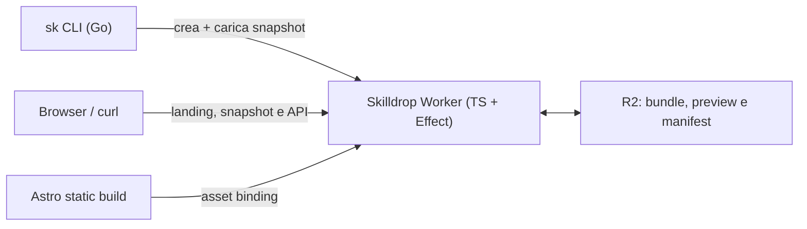

# Skilldrop — Architettura MVP

## Decisione

L'MVP è composto da una sola applicazione serverless:

- una **CLI Go** (prossimo step), costruita con Cobra;
- un **Cloudflare Worker TypeScript** che gestisce upload, lettura e download;
- un bucket **Cloudflare R2** che contiene un bundle per snapshot;
- infrastruttura dichiarata in TypeScript con **Alchemy** e modellata con
  **Effect**;
- un sito **Astro** statico, pubblicato come asset dello stesso Worker.

Non introduciamo ora un servizio Go, D1, KV, autenticazione o un database. Per
uno snapshot pubblico bastano un ID non enumerabile e un bundle immutabile su
R2. Alchemy supporta risorse Cloudflare e binding tipizzati al Worker;
Effect è utile per mantenere infrastruttura, handler e failure espliciti nella
stessa stack TypeScript. [Alchemy](https://alchemy.run/)

## Principi di prodotto

Skilldrop trasferisce una skill già esistente, non pubblica un package in un
registry. Quindi:

- ogni `share` crea uno snapshot nuovo e immutabile;
- non esistono versioni semantiche, aggiornamenti in-place o discovery globale;
- una URL è un capability link non elencato, non un nome di package;
- l'installazione mostra i file e non esegue mai script presenti nella skill.

## Architettura



Il Worker è l'unica API pubblica. R2 non viene esposto direttamente: il Worker
convalida l'upload, applica la policy di scadenza e restituisce gli header di
sicurezza e cache corretti. Cloudflare esegue il codice Worker prima degli
asset solo per `/s/*` e `/v1/*`; tutte le altre route vengono servite
direttamente dal build statico Astro.

## Snapshot e formato bundle

La scelta consigliata è **`tar.gz`**:

- `tar` rappresenta naturalmente una directory e mantiene i mode Unix;
- `gzip` è disponibile nella standard library di Go;
- il formato è noto, portabile e facile da ispezionare;
- un archivio deterministico permette checksum riproducibili.

La CLI costruisce un archivio con una singola directory radice, `SKILL.md`
obbligatorio e `skilldrop.manifest.json` generato automaticamente. Il manifest
contiene versione del protocollo, inventario dei file, dimensioni, flag
eseguibile e SHA-256 di ogni file. Lo SHA-256 del bundle compresso è registrato
separatamente: non può essere dentro lo stesso archive senza un hash circolare.

Regole applicate dalla CLI, e verificate nuovamente durante l'estrazione:

- solo file regolari e directory;
- nessun path assoluto, `..`, path duplicato o device/FIFO;
- nessun symlink nell'MVP;
- ordinamento lessicografico e metadata tar normalizzati;
- limiti espliciti per numero di file, file singolo e bundle totale;
- i file eseguibili restano inclusi ma sono riportati come warning.

### Bundle canonico e preview separata

Il bundle è l'unica fonte canonica dello snapshot. R2 conserva esattamente un
oggetto, la cui key usa l'ID pubblico generato dal Worker:

```text
snapshots/<id>.tar.gz
```

`GET /s/:id/bundle` fa streaming diretto di questo oggetto R2. Per
`GET /s/:id`, il Worker legge il bundle, estrae esclusivamente l'entry root
`SKILL.md` e la restituisce come Markdown raw. È una scelta deliberatamente
semplice e appropriata finché i bundle hanno un limite piccolo; un endpoint di
preview molto trafficato o bundle grandi potranno introdurre una copia derivata
di `SKILL.md` in un secondo momento.

## API MVP

Le route sono versionate per la CLI; la route leggibile rimane corta e stabile.

| Metodo | Route | Scopo |
| --- | --- | --- |
| `POST` | `/v1/snapshots` | Crea un ID e un capability di upload monouso |
| `PUT` | `/v1/snapshots/:id` | Carica il bundle `tar.gz` |
| `GET` | `/s/:id` | Restituisce il contenuto raw di `SKILL.md` |
| `GET` | `/s/:id/bundle` | Scarica `bundle.tar.gz` come attachment |
| `GET` | `/v1/snapshots/:id` | Restituisce manifest e metadati per `sk inspect` |

`GET https://skilldrop.dev/s/{id}` risponde con `Content-Type: text/markdown;
charset=utf-8` e il contenuto raw della skill. Non renderizza HTML nell'MVP.
`GET https://skilldrop.dev/s/{id}/bundle` risponde con
`Content-Type: application/gzip` e `Content-Disposition: attachment`; è la
route usata da `sk install`.

### Upload

Il flow della CLI è:

```text
POST /v1/snapshots
  → Worker genera ID + token di upload
PUT /v1/snapshots/{id}
  → CLI carica il bundle nello slot associato a quell'ID
GET /s/{id}
  → snapshot pubblicato, restituisce SKILL.md
```

L'ID viene quindi generato esclusivamente dal Worker, mai dalla CLI. La route
di upload include l'ID generato nella URL: una `PUT /` globale renderebbe meno
chiari autorizzazione, retry e log di un singolo snapshot. Nell'MVP l'ID è
anche il capability necessario a caricare: deve quindi essere lungo, casuale,
non riusabile e non essere mostrato finché la `PUT` non è completata.

Il primo `POST` restituisce:

```json
{
  "id": "7fx2ka…",
  "upload_url": "https://skilldrop.dev/v1/snapshots/7fx2ka…",
  "expires_at": "2026-08-04T12:05:00Z"
}
```

L'ID pubblico deve avere almeno 128 bit di casualità e usare un encoding
URL-safe. Il Worker scrive con una precondizione R2 equivalente a
`If-None-Match: *`: la prima `PUT` crea l'oggetto, ogni successiva `PUT` viene
rifiutata atomicamente. Uno snapshot non può quindi essere sovrascritto, anche
in presenza di richieste concorrenti. La CLI non stampa la URL pubblica fino a
risposta positiva dell'upload.

La `PUT` ha body `application/gzip`. Il Worker applica un limite alla
dimensione, verifica che il bundle contenga un `SKILL.md` root valido e lo
scrive in R2 con content type `application/gzip`. Non ci sono metadati o
oggetti R2 aggiuntivi nell'MVP.

> Alternativa futura: URL presigned R2 per bundle grandi. Non serve nell'MVP:
> tenere il Worker nel percorso rende semplice l'atomicità logica e la policy.

## Metadati, R2 e scadenza

Gli unici metadati MVP sono quelli strettamente necessari al bundle: content
type, dimensione, hash SHA-256 e, se si abilita expiry, la data di scadenza nei
metadati custom R2. `sk inspect` scarica il bundle e legge il manifest interno,
non interroga un database.

Alla scadenza il Worker restituisce `410 Gone` e non serve né preview né
bundle. Una cron job potrà eliminare gli oggetti scaduti. L'expiry può restare
fuori dal primissimo rilascio per mantenere il Worker completamente stateless.

## Sicurezza

- Confrontare SHA-256 del bundle prima di estrarlo e hash dei file durante
  l'estrazione.
- Estrarre in una staging directory; spostare nella directory agente soltanto
  dopo la validazione e il consenso dell'utente.
- Non sovrascrivere skill installate senza un flag esplicito in una futura CLI.
- Mostrare file, dimensioni e warning, in particolare i file eseguibili, prima
  dell'installazione.
- Rate limit su `POST` e upload; definire limiti piccoli all'avvio per evitare
  abuso e costi inattesi.
- Limitare CORS agli asset web necessari; non rendere il bucket R2 pubblico.
- Loggare request ID e metriche aggregate, mai contenuto di skill per default.

Un capability link non è autenticazione. Finché le snapshot sono unlisted ma
pubbliche è appropriato; le skill private richiederanno identità e token di
download espliciti nel post-MVP.

## Infrastruttura Alchemy + Effect

La stack dichiara R2, Worker, route custom domain e, quando servirà, cron di
cleanup. Il Worker riceve il binding R2 tipizzato dall'entry `alchemy.run.ts`;
le operazioni applicative usano Effect dove rende espliciti errori, limiti e
osservabilità, senza forzare l'intera CLI o la UI ad adottarlo.

```text
backend/alchemy.run.ts  Stack, build Astro, R2, Worker, dominio e cron
backend/src/worker.ts   router HTTP, asset config e handler Effect
backend/src/snapshot.ts validazione manifest e policy R2
frontend/               landing page Astro statica
cmd/sk/                 CLI Go (prossimo step)
```

Alchemy è attualmente in beta: isoliamo le dichiarazioni IaC in
`alchemy.run.ts` e non facciamo dipendere il protocollo snapshot dalle sue API.
Questo preserva la possibilità di migrare infrastruttura senza rompere link o
versioni della CLI. [Alchemy](https://alchemy.run/)

## Evoluzione post-MVP

1. Aggiungere la preview web con file tree e checksum, lasciando invariati
   `/s/:id` raw e `/s/:id/bundle`.
2. Aggiungere un manifest/preview separata se limiti o traffico rendono
   sconveniente l'estrazione del bundle nel Worker.
3. Aggiungere account e ownership con Better Auth + Bun, dietro le stesse API
   versionate.
4. Introdurre snapshot private con autorizzazione di download, non solo URL
   difficili da indovinare.
5. Valutare D1 quando servono dashboard, ownership, quote e query; non prima.
6. Passare a presigned upload per bundle oltre il limite ragionevole del Worker.
