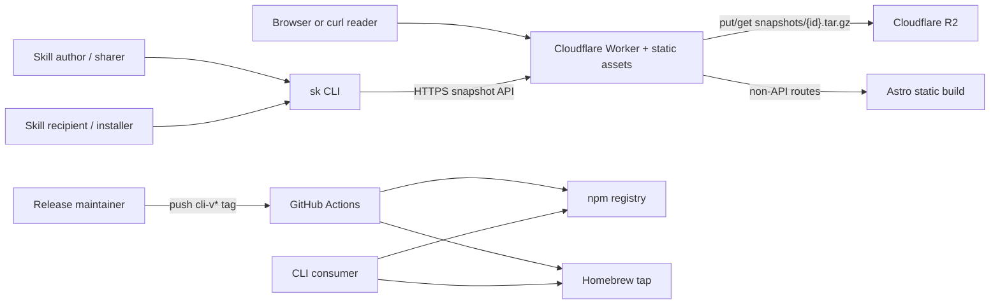
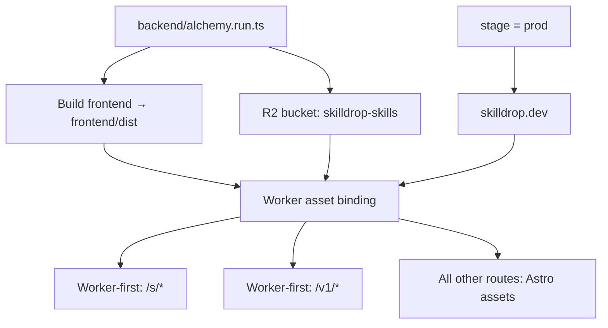
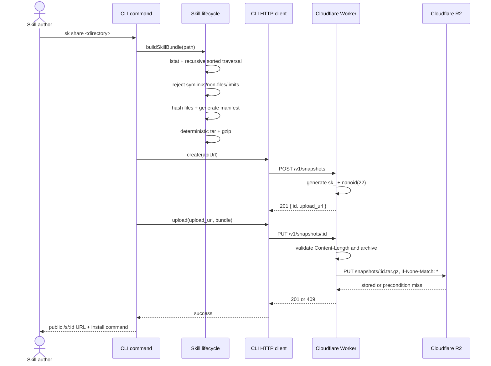
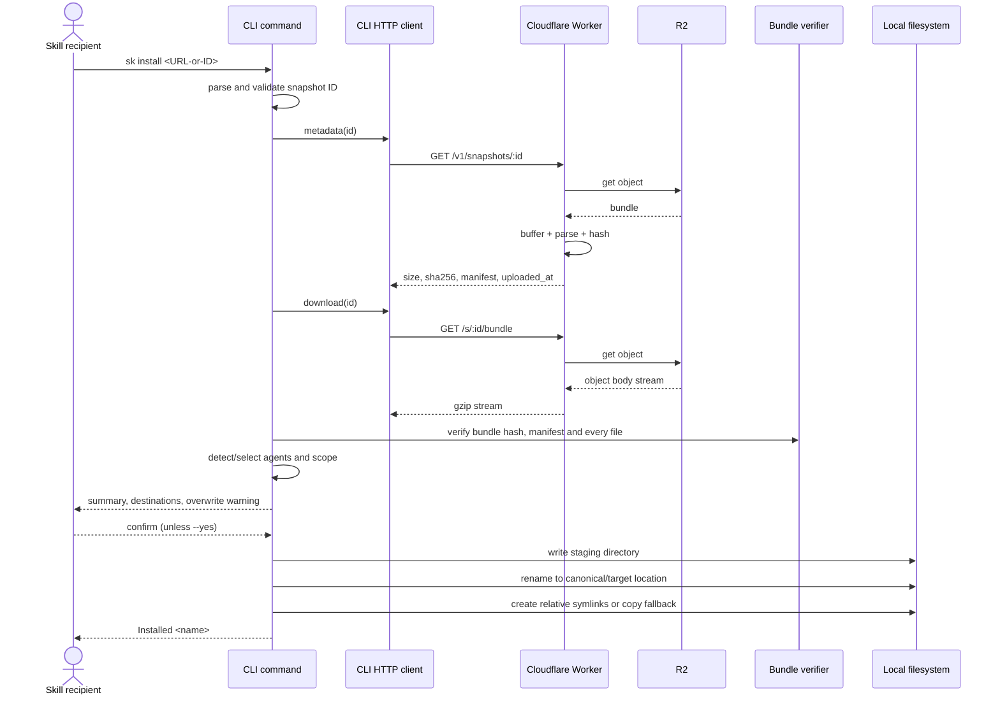
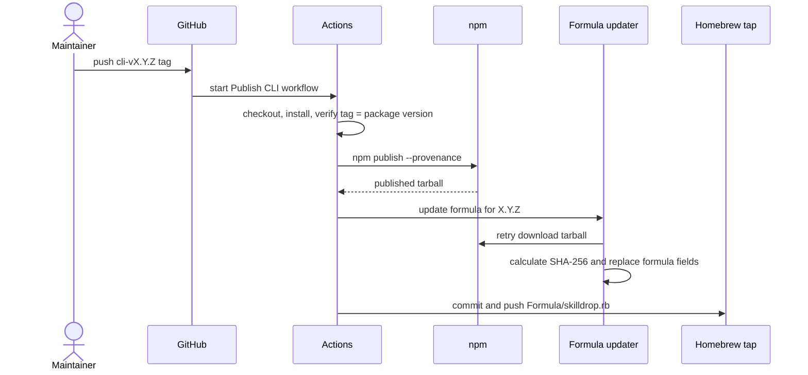
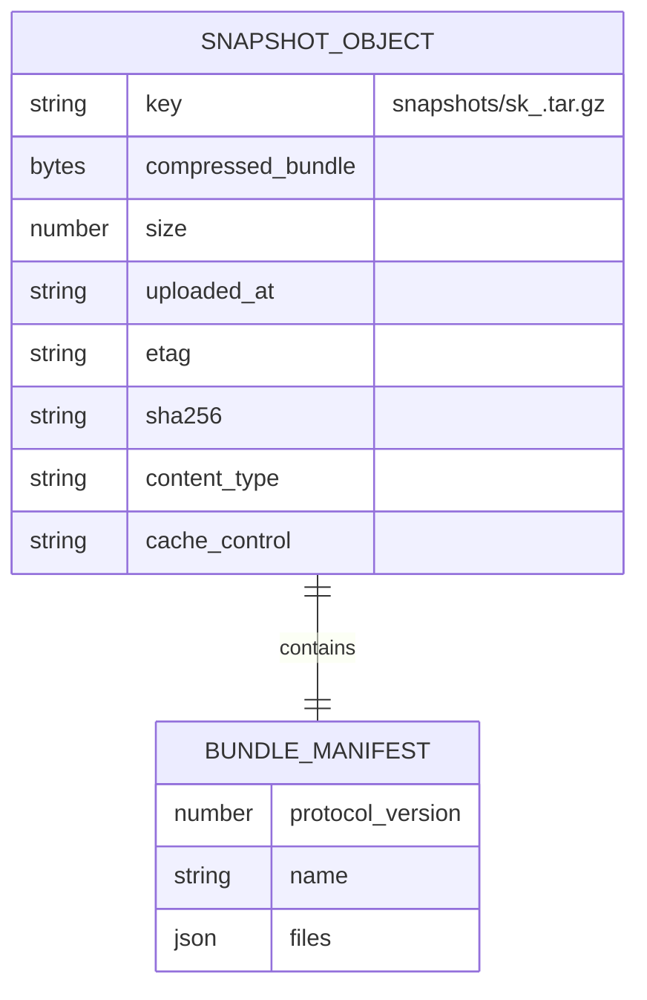

# Skilldrop: Full Architecture and Actor Map

> Current-state architecture derived from the repository source on 2026-08-04.
> This document describes what is implemented. Product intentions that are not
> yet implemented are called out separately under **Known gaps and drift**.

## 1. Executive summary

Skilldrop transfers an agent skill directory from one machine to another through
an immutable, unlisted snapshot. It is deliberately a transfer service rather
than a registry or marketplace.

The implemented system has three product runtimes and one delivery pipeline:

1. **`sk` CLI** — validates, packages, uploads, downloads, verifies, and installs
   skills. It is TypeScript built into a Node-compatible executable and uses
   Effect for command orchestration and platform services.
2. **Cloudflare Worker API** — creates snapshot IDs, validates uploads, enforces
   write-once storage, serves raw `SKILL.md`, returns metadata, and streams the
   bundle.
3. **Astro static website** — serves the marketing pages. It is built as part of
   the backend deployment and attached to the Worker as static assets.
4. **Release automation** — publishes the CLI to npm and updates a Homebrew tap
   when a `cli-v*` Git tag is pushed.

There is no database, user account, authentication system, registry, search
index, or backend application server. Cloudflare R2 is the only persistent
store, and each snapshot is one `tar.gz` object.



## 2. Architectural invariants

These are the most important rules embodied by the current code:

- A share operation creates a new random snapshot ID.
- A snapshot object can be written only once; R2's conditional write makes the
  immutability decision atomic.
- The public snapshot ID is unlisted but is not an authentication credential.
- The uploaded object is the canonical snapshot. Metadata and preview content
  are derived from the bundle on read; there is no secondary database record.
- A bundle must be gzip-compressed tar and contain root `SKILL.md` and root
  `skilldrop.manifest.json` entries.
- Skill payloads contain regular files. The CLI rejects symlinks at source; the
  Worker additionally tolerates harmless tar directory entries, and both archive
  readers reject unsafe paths and special entry types.
- Installation verifies the bundle checksum, manifest structure, file inventory,
  file sizes, and per-file checksums before writing anything.
- Installation copies files but never executes files from the snapshot.
- Static website traffic and snapshot/API traffic share one Cloudflare Worker
  deployment, but only `/s/*` and `/v1/*` are forced through application code.

## 3. Actors: who does what

### 3.1 Human and external actors

| Actor | Starts | Responsibilities | Does not do |
| --- | --- | --- | --- |
| Skill author / sharer | `sk share <path>` | Chooses a local skill directory; receives the public link after a successful upload | Does not choose the snapshot ID or upload directly to R2 |
| Skill recipient / installer | `sk install <url-or-id>` | Chooses target agents and project/global scope; confirms overwrites unless `--yes` is used | Does not trust the archive without local verification; does not run included scripts |
| Browser or `curl` reader | `GET /s/:id` | Reads the root `SKILL.md` as raw Markdown | Does not receive a rendered snapshot page in the current implementation |
| CLI consumer | npm or Homebrew install | Installs and invokes the published `sk` executable | Does not need Bun at runtime; the package declares Node 20+ |
| Project maintainer | Alchemy deploy or release tag | Deploys the Worker/site and initiates CLI releases | Does not manually calculate Homebrew checksums in the release flow |
| GitHub Actions | `cli-v*` tag | Validates the tag/package version, publishes npm with provenance, updates and pushes the tap formula | Does not deploy the Worker or website |
| npm registry | Publication/download | Stores the `@skilldrop/cli` package tarball | Does not store skill snapshots |
| Homebrew tap | Formula distribution | Points Homebrew at the npm tarball and installs its `sk` binary | Is not the snapshot service |
| Cloudflare edge runtime | Every site/API request | Runs Worker routes and serves bound static assets | Does not persist snapshot metadata outside R2 |
| Cloudflare R2 | Worker storage calls | Stores immutable bundle objects and their HTTP metadata | Is not public and is not accessed by the CLI directly |

### 3.2 Internal software actors

| Component | Source | Owns |
| --- | --- | --- |
| CLI process bootstrap | `cli/src/main.ts` | Runtime layers, configuration, logging, top-level CLI error rendering |
| CLI command coordinator | `cli/src/commands.ts` | `share` and `install` user journeys, prompts, selection, and console output |
| CLI HTTP client | `cli/src/api.ts` | Snapshot API URLs, status expectations, response decoding, network error mapping |
| Agent registry/resolver | `cli/src/agents.ts` | Known agent paths, installed-agent detection, scope resolution, canonical/target roots |
| Skill lifecycle | `cli/src/skill.ts` | Source traversal, bundle construction, bundle verification, staged install, symlink/copy behavior |
| Tar/manifest codec | `cli/src/archive.ts` | Protocol-v1 manifest schema, deterministic tar encoding, safe tar decoding, gzip, SHA-256 |
| CLI error model | `cli/src/errors.ts` | User-facing typed `CliError` and unknown-cause messages |
| HTTP contract | `backend/src/api.ts` | Method/path/payload/success/error schemas for all public endpoints |
| Backend wire models | `backend/src/models.ts` | Snapshot ID, metadata, success classes, and typed HTTP error responses |
| Backend snapshot reader | `backend/src/snapshot.ts` | Size bounds, gzip expansion, safe tar parsing, required-root-file checks, bundle hash |
| Worker implementation | `backend/src/worker.ts` | Route handlers, R2 access, ID generation, conditional upload, caching/security headers |
| R2 resource | `backend/src/bucket.ts` | Alchemy declaration for the `skilldrop-skills` bucket |
| Infrastructure stack | `backend/alchemy.run.ts` | Stage, Cloudflare provider, local Alchemy state, website build, bucket and Worker deployment |
| Static site | `frontend/src/**` | Landing pages, presentation, metadata, copy-to-clipboard interaction |
| CLI release workflow | `.github/workflows/publish-cli.yml` | npm and Homebrew publication after a release tag |
| Formula updater | `cli/scripts/update-homebrew-formula.ts` | npm tarball polling, SHA-256 calculation, formula field replacement |

### 3.3 Responsibility matrix

`P` means primary owner; `V` means validates or verifies; `C` means consumes.

| Concern | CLI | Worker | R2 | Astro | GitHub Actions |
| --- | :---: | :---: | :---: | :---: | :---: |
| Source directory validation | P |  |  |  |  |
| Manifest generation | P |  |  |  |  |
| Bundle creation | P |  |  |  |  |
| Snapshot ID generation |  | P |  |  |  |
| Upload size/archive checks | V | P |  |  |  |
| Write-once enforcement |  | P | P |  |  |
| Bundle persistence |  |  | P |  |  |
| Preview derivation |  | P | C |  |  |
| Download streaming | C | P | C |  |  |
| Install integrity verification | P |  |  |  |  |
| Agent destination selection | P |  |  |  |  |
| Static marketing pages |  | C |  | P |  |
| CLI package publication |  |  |  |  | P |

## 4. Repository topology

```text
skilldrop/
├── cli/                      TypeScript/Effect CLI package
│   ├── src/                  commands, API client, archive and install logic
│   ├── test/                 unit and lifecycle tests
│   └── scripts/              release/formula helper
├── backend/                  Cloudflare Worker and Alchemy stack
│   ├── src/                  API, models, validator, R2 binding, Worker handlers
│   └── alchemy.run.ts         infrastructure entry point
├── frontend/                 static Astro website
│   ├── src/pages/             dark home page and light variant
│   ├── src/layouts/           shared HTML metadata shell
│   ├── src/styles/            site styles
│   └── public/                icons and social cards
├── Formula/skilldrop.rb      in-repository Homebrew formula template
├── .github/workflows/       CLI publication automation
├── repos/                    vendored read-only reference repositories
├── ARCHITECTURE.md           earlier MVP design document
├── PRODUCT.md                product definition
├── scope.md                  product scope and roadmap
└── positioning.md            category and positioning notes
```

The root is a Bun workspace containing `frontend`, `backend`, and `cli`.
Application code imports installed dependencies; nothing imports from `repos/`.

## 5. Deployment topology

`backend/alchemy.run.ts` defines an Alchemy stack named `Skilldrop`:

1. Load the current Alchemy stage and Cloudflare providers.
2. Build `frontend/` by running `bun run build`.
3. Provision or bind the `skilldrop-skills` R2 bucket.
4. Create `SkilldropWorker` with the Astro `dist` directory as its asset bundle.
5. Bind `skilldrop.dev` only when the Alchemy stage is `prod`; non-production
   stages use the generated Worker URL.
6. Return the bucket name and Worker URL as stack outputs.

Alchemy state is configured as local state. The snapshot protocol does not
depend on Alchemy-specific wire types; Alchemy is the provisioning and binding
layer.



## 6. End-to-end flows

### 6.1 Share a local skill



The CLI does not print the public URL until the upload returns `201`. The create
operation does not reserve a record in a database: the first successful R2 write
to the generated key is the act that creates the snapshot.

### 6.2 Install a snapshot



The metadata and bundle are separate reads of the same immutable object. This is
safe because the object cannot be replaced. The CLI additionally compares the
manifest decoded from the downloaded bundle to the manifest returned by the
metadata endpoint.

### 6.3 Read or download a snapshot

| Request | Worker behavior | R2 behavior | Response |
| --- | --- | --- | --- |
| `GET /s/:id` | Buffers the bundle, decompresses/parses it, extracts root `SKILL.md` | Returns the object | Raw Markdown, 5-minute public cache, ETag, `nosniff` |
| `GET /s/:id/bundle` | Streams the R2 body without reparsing it | Returns the object body | `application/gzip`, attachment, 1-year immutable cache, ETag, `nosniff` |
| `GET /v1/snapshots/:id` | Buffers, parses, and hashes the bundle | Returns object plus upload time and size | JSON metadata, default 5-minute public cache |

There is currently no browser-specific content negotiation for `/s/:id`; normal
browsers and command-line clients both receive raw Markdown.

### 6.4 Serve the website

Requests outside `/s/*` and `/v1/*` resolve against the Astro static asset
binding. `frontend/src/layouts/BaseLayout.astro` owns canonical/SEO/social tags,
while page components own content and the small clipboard interaction. No
website request reaches R2.

### 6.5 Publish the CLI



The Homebrew job depends on successful npm publication. It needs repository-level
configuration for `HOMEBREW_TAP_REPOSITORY` and `HOMEBREW_TAP_TOKEN`.

## 7. CLI architecture

### 7.1 Runtime composition

`cli/src/main.ts` composes these Effect layers:

- `NodeServices.layer` for filesystem, path, crypto, terminal, and Node runtime
  services;
- `SkilldropApi.layer`, itself backed by Effect's fetch HTTP client;
- a pretty console logger.

`SKILLDROP_DEV` is read as a boolean. When true, the root command exposes the
shared `--api-url` flag; production builds always use `https://skilldrop.dev` and
do not expose that override.

Typed `CliError` failures are rendered to stderr, and the Node runtime is asked
not to print an additional error report.

### 7.2 Implemented command surface

| Command | Important flags | Behavior |
| --- | --- | --- |
| `sk share <path>` | Development-only `--api-url` | Validates and packages one directory, creates an ID, uploads the bundle, prints its link |
| `sk install <snapshot>` | repeatable `--agent/-a`, `--scope`, `--yes/-y`, `--copy`; development-only `--api-url` | Fetches metadata and bundle, verifies both, selects destinations, confirms, and installs |

The snapshot argument accepts either a bare `sk_<22 chars>` ID or a URL/path
whose final segment is that ID.

### 7.3 Agent selection and destination ownership

The CLI owns an explicit registry of supported agents:

| Agent | Project skill directory | Global skill directory | Detection path |
| --- | --- | --- | --- |
| AiderDesk | `.aider-desk/skills` | `~/.aider-desk/skills` | `~/.aider-desk` |
| Claude Code | `.claude/skills` | `~/.claude/skills` | `~/.claude` |
| Codex | `.agents/skills` | `~/.agents/skills` | `~/.codex` |
| Cursor | `.agents/skills` | `~/.agents/skills` | `~/.cursor` |
| Gemini CLI | `.agents/skills` | `~/.agents/skills` | `~/.gemini` |
| GitHub Copilot | `.agents/skills` | `~/.agents/skills` | `~/.copilot` |
| Goose | `.goose/skills` | `$XDG_CONFIG_HOME/goose/skills` | `$XDG_CONFIG_HOME/goose` |
| OpenCode | `.agents/skills` | `~/.agents/skills` | `$XDG_CONFIG_HOME/opencode` |
| OpenHands | `.openhands/skills` | `~/.openhands/skills` | `~/.openhands` |
| Universal | `.agents/skills` | `~/.agents/skills` | not auto-detected |

If `XDG_CONFIG_HOME` is absent, it defaults to `~/.config`.

Selection behavior:

- Explicit `--agent` values bypass detection/prompt selection.
- Interactive mode preselects detected agents; if none are detected it
  preselects Claude Code, Codex, and OpenCode.
- The universal destination is added unless the user already selected it.
- `--yes` chooses all detected agents plus Universal and defaults to project
  scope. If no agents are detected, it selects Universal only.
- Project scope is rooted at the current working directory; global scope uses
  the user's home directory and each agent's declared global path.
- Duplicate physical roots are collapsed.

### 7.4 Copy and symlink strategy

- `--copy`, or a selection that resolves to only one target root, installs an
  independent copy into every target root.
- Multiple roots default to one canonical copy under `.agents/skills`, followed
  by relative symlinks from agent-specific roots.
- If symlink creation fails, the CLI falls back to copying that target.
- Existing destinations are listed before confirmation.
- The current install implementation then removes and replaces approved
  destinations; `--yes` skips the confirmation.
- Files are first written beneath a temporary `.skilldrop-*` directory inside
  the target root and then renamed into place. An Effect scope finalizer cleans
  up leftover staging directories.

## 8. Snapshot and archive protocol

### 8.1 Object and identifier

```text
public ID:     sk_<22 URL-safe nanoid characters>
R2 key:        snapshots/<id>.tar.gz
media type:    application/gzip
download name: bundle.tar.gz
```

The 22-character Nano ID is generated at the Worker. There is no separate
snapshot row or reservation. The ID is exposed to the CLI in both `id` and
`upload_url`; the same ID becomes the public read capability after upload.

### 8.2 Bundle contents

The CLI creates a ustar-compatible archive of regular files with:

- root paths relative to the selected skill directory;
- lexicographically sorted recursive traversal;
- UID/GID and mtime normalized to zero;
- preserved permission bits (`mode & 0777`);
- a required non-empty root `SKILL.md`;
- a generated root `skilldrop.manifest.json`.

The generated protocol-v1 manifest is:

```json
{
  "protocol_version": 1,
  "name": "review-pr",
  "files": [
    {
      "path": "SKILL.md",
      "size": 1234,
      "sha256": "<64 lowercase hex characters>"
    }
  ]
}
```

The generated manifest describes source files but does not include itself. The
bundle's SHA-256 is not placed inside the archive; it is calculated by the
Worker and returned from the metadata endpoint.

### 8.3 Limits

| Limit | CLI producer/installer | Worker validator |
| --- | ---: | ---: |
| Compressed bundle | 10 MiB | 10 MiB |
| Uncompressed archive | 32 MiB | 32 MiB |
| Individual file | 2 MiB | 2 MiB |
| User files | 255 | Effectively 256 regular entries total, including manifest |
| Skill name | 1–128 constrained characters | Stored manifest is only checked as a generic JSON record |

The CLI's 255-source-file limit leaves room for the generated manifest within
the Worker's 256-entry ceiling.

### 8.4 Validation split

| Check | Share CLI | Upload Worker | Install CLI |
| --- | :---: | :---: | :---: |
| Source root is a real directory, not a symlink | ✓ |  |  |
| Source entries are regular files and within limits | ✓ |  |  |
| No archive absolute/traversal/backslash/duplicate paths | ✓ | ✓ | ✓ |
| Only allowed tar entry types | regular only | regular files/directories | regular only |
| Tar header checksum | created | ✓ | ✓ |
| Required root `SKILL.md` | ✓ | ✓ | ✓ |
| Required root manifest | generated | ✓ | ✓ |
| Strict protocol-v1 manifest schema | ✓ | no | ✓ |
| Manifest inventory equals archive inventory | generated | no | ✓ |
| Every file size/hash equals manifest | generated | no | ✓ |
| Compressed bundle SHA-256 |  | calculated/stored | ✓ against metadata |
| Metadata manifest equals downloaded manifest |  | derived | ✓ |

This split means the service accepts only structurally safe snapshots, while the
official CLI applies the stronger protocol and installation integrity checks. A
non-CLI uploader could currently store an archive whose manifest is structurally
a JSON object but does not accurately describe the files; the official CLI will
reject it during installation.

## 9. HTTP API contract

| Method | Route | Success | Purpose |
| --- | --- | --- | --- |
| `POST` | `/v1/snapshots` | `201` JSON `{ id, upload_url }` | Generate a candidate snapshot ID and upload URL |
| `PUT` | `/v1/snapshots/:id` | `201` empty | Validate and atomically store a gzip bundle |
| `GET` | `/v1/snapshots/:id` | `200` JSON metadata | Return object size, derived hash/manifest, and R2 upload time |
| `GET` | `/s/:id` | `200` Markdown | Return root `SKILL.md` |
| `GET` | `/s/:id/bundle` | `200` gzip stream | Download the canonical object |

All route IDs must match `^sk_[A-Za-z0-9_-]{22}$`.

### 9.1 Upload outcomes

| Status | Typed error | Meaning |
| --- | --- | --- |
| `400` | `BadRequest` | Declared content length differs from body length |
| `409` | `SnapshotConflict` | The key was already written |
| `413` | `PayloadTooLarge` | Missing, invalid, empty, or over-limit `Content-Length` |
| `422` | `InvalidSnapshot` | Gzip/tar/path/required-file validation failed |

Missing snapshot reads return `404 SnapshotNotFound`. Unexpected defects remain
failed causes after the Worker attempts to recover any Effect error that can
render itself as an HTTP response.

### 9.2 Cache and object metadata

Successful GET responses receive a default `public, max-age=300` unless a
handler already set a cache policy. All non-GET, non-200, and typed error
responses receive `no-store`.

The stored R2 object records:

- SHA-256 calculated from the compressed bytes;
- `application/gzip` content type;
- attachment filename `bundle.tar.gz`;
- `public, max-age=31536000, immutable` cache metadata.

The bucket itself is not declared public. The Worker is the public data plane.

## 10. Data model and consistency

There is one persistent entity: the R2 bundle object.



Consistency properties:

- **Creation:** ID generation is stateless; an object exists only after `PUT`.
- **Atomic immutability:** `etagDoesNotMatch: "*"` makes concurrent first-write
  attempts resolve to one success and conflicts for the others.
- **Read-after-write:** the CLI prints the link after Worker/R2 confirmation.
- **No cross-record transactions:** none are needed because a snapshot is one
  object.
- **Derived metadata:** manifest and bundle hash are recomputed by parsing the
  stored object on metadata reads.
- **Orphan candidate IDs:** a successful `POST` followed by no `PUT` leaves no
  persistent state and requires no cleanup.

## 11. Security and trust boundaries

### 11.1 Boundary map

```mermaid
flowchart LR
  Local["Untrusted local skill tree"] -->|"lstat, limits, hashing"| Producer["Trusted CLI producer"]
  Producer -->|"untrusted network upload"| Gate["Worker validation gate"]
  Gate -->|"conditional write"| Store["Private R2 bucket"]
  Store -->|"untrusted downloaded bytes"| Installer["CLI verifier"]
  Installer -->|"staged files"| Targets["Agent skill directories"]
```



### 11.2 Implemented controls

- Source and archive path traversal protection.
- Rejection of absolute paths, `..`, `.`, empty path components, and backslashes.
- Source symlink rejection and archive link/device/FIFO rejection.
- Compressed, expanded, per-file, and file-count bounds.
- UTF-8 validation for `SKILL.md` on the Worker and manifest JSON on the CLI.
- Tar header checksums and SHA-256 at bundle and file level.
- Write-once R2 condition, not a read-then-write race.
- Staged local installation followed by rename.
- Explicit user confirmation with overwrite destinations shown, unless `--yes`.
- No automatic execution of installed content.
- `nosniff` on preview and download responses.
- Long-lived immutable cache only for immutable bundle downloads.

### 11.3 Deliberate or current limitations

- Snapshot links are unlisted public capabilities, not authenticated private
  resources.
- The upload URL has no token separate from the public ID. Possession of a
  freshly created ID before its first write is sufficient to attempt the upload.
- There is no rate limiting, quota, abuse workflow, malware scanning, account
  ownership, deletion API, or expiry policy in this repository.
- The Worker performs structural archive validation but does not validate the
  strict manifest inventory and per-file hashes before storage.
- The installer can overwrite existing skills after the general confirmation;
  there is no separate `--force` gate.
- Executable permission bits are preserved, but the manifest has no executable
  field and the current install UI does not warn about executable files.

## 12. Frontend architecture

The frontend is an Astro static site (`output: "static"`, no trailing slash)
with canonical site origin `https://skilldrop.dev`.

- `BaseLayout.astro` owns the document shell, favicon, theme, canonical URL,
  Open Graph, and Twitter metadata.
- `pages/index.astro` is the dark primary landing page.
- `pages/versions/light.astro` is an alternate light presentation.
- The only client behavior is a small inline clipboard script with a prompt
  fallback.
- Google Fonts are loaded from external font origins at runtime.
- The site has no API client, authentication, or snapshot rendering component.

The website is compiled during the Alchemy backend deployment, not by a separate
website deployment workflow.

## 13. Effect boundaries and failure model

Effect is used in both CLI and Worker, with different platform layers:

- The CLI uses Node platform services and the Effect CLI/HTTP packages.
- The Worker uses Alchemy Cloudflare bindings and Effect HTTP API builders.
- Schemas define snapshot IDs, CLI manifests, API responses, and typed errors.
- Named `Effect.fn` operations make the major lifecycle steps observable and
  keep errors local to their responsibility.
- CLI platform/network errors are mapped into user-facing `CliError` values.
- Expected Worker failures are tagged errors with explicit HTTP schemas.
- R2 operational failures and invalid already-stored objects are treated as
  defects (`orDie`), distinguishing infrastructure corruption from user input.
- `HttpPlatformStub` supplies the minimum web platform behavior needed by the
  Effect HTTP builder in the Cloudflare runtime; response compression and file
  responses are intentionally unsupported there.

## 14. Build, test, and release ownership

### 14.1 Build commands

| Surface | Command | Output |
| --- | --- | --- |
| CLI | `bun run --cwd cli build` | Minified Node-targeted `cli/dist/sk.js` with shebang |
| CLI checks | `bun run --cwd cli check` | TypeScript and Effect diagnostics |
| CLI tests | `bun run --cwd cli test` | Bun test suite |
| Frontend | `bun run --cwd frontend build` | Checked static Astro build in `frontend/dist` |
| Backend development | `bun run --cwd backend dev` | Alchemy development environment |
| Backend deployment | `bun run --cwd backend deploy` | Alchemy deployment |

### 14.2 Existing automated coverage

The repository currently verifies:

- tar round trips and traversal rejection;
- platform SHA-256 behavior;
- build → verify → install lifecycle without script execution;
- rejection of a tampered compressed bundle;
- backend parsing of a valid snapshot;
- backend rejection of missing root `SKILL.md` and unsafe paths;
- Homebrew formula URL, checksum, and version rendering.

At the time this document was generated, all 6 CLI tests and all 3 backend
snapshot tests passed, and the CLI type/Effect diagnostic check reported no
errors or warnings. The Astro check and static production build also passed and
generated both configured pages. A direct backend TypeScript check found no
ordinary TypeScript errors but exited non-zero on seven configured Effect
`asyncFunction` diagnostics in `snapshot.ts` and its tests; the backend package
does not currently define a dedicated `check` script.

Not currently covered in-repository:

- Worker route/R2 integration behavior;
- conditional-write concurrency;
- full CLI-to-Worker end-to-end operation;
- agent detection, prompting, and symlink fallback;
- frontend build or accessibility in CI;
- deployment smoke tests.

### 14.3 Release artifact chain

The CLI package is `@skilldrop/cli`, versioned independently with a `cli-vX.Y.Z`
Git tag. `prepack` runs check, tests, and build. The npm package publishes
`dist/` and `README.md`, exposes `dist/sk.js` as `sk`, and requires Node 20+.

The Homebrew formula downloads that npm tarball, installs it under `libexec`,
and symlinks `dist/sk.js` into Homebrew's `bin/sk`.

## 15. Configuration and secrets

| Name | Reader | Purpose |
| --- | --- | --- |
| `SKILLDROP_DEV` | CLI | Enables development mode and the `--api-url` flag |
| `HOME` | CLI | Resolves global and canonical agent roots |
| `XDG_CONFIG_HOME` | CLI | Resolves Goose/OpenCode paths; defaults to `~/.config` |
| Alchemy stage | Infrastructure | Enables the `skilldrop.dev` domain only for `prod` |
| Cloudflare credentials/config | Alchemy provider | Provisions and deploys Worker/R2 resources |
| `NPM_TOKEN` | GitHub Actions | Publishes the CLI package |
| `HOMEBREW_TAP_REPOSITORY` | GitHub Actions variable | Selects the external tap repository |
| `HOMEBREW_TAP_TOKEN` | GitHub Actions secret | Pushes the updated tap formula |

## 16. Known gaps and documentation drift

The older product/architecture documents describe the intended MVP and later
ideas. The following are not present in the current code:

| Stated or implied capability | Current implementation |
| --- | --- |
| Go/Cobra CLI | CLI is TypeScript/Effect, built for Node |
| `sk list`, `sk inspect`, `sk remove` | Only `share` and `install` exist |
| Share by known skill name | `share` accepts a filesystem path only |
| Display every file before installation | Install summary displays the file count and destinations, not the file list |
| Executable warnings/manifest flag | Modes are preserved, but the manifest lacks an executable field and no warning is printed |
| Expiration and `expires_at` | No expiry metadata, cron, or `410 Gone` behavior |
| Private snapshots/accounts | No identity or authorization system |
| Dedicated one-time upload capability | Upload authority is the not-yet-published snapshot ID itself |
| Formatted snapshot page | `/s/:id` always returns raw Markdown |
| Preview file tree/checksum UI | Not implemented |
| `--expires`, `--private`, `--dry-run` | Not implemented |
| Separate explicit overwrite flag | General confirmation or `--yes` authorizes replacement |
| Rate limiting and metrics | Not implemented in this repository |
| Deployment/release CI for backend/site | Only the CLI publish workflow exists |
| `getsk.dev/install.sh` installer | Referenced by website copy, not implemented in this repository |

There is also content drift in the landing page examples: some display
`skilldrop.io`, a 90-day expiry, `sk inspect`, and executable/file disclosure
claims that the current runtime does not provide. The configured canonical site
and API origin are `skilldrop.dev`.

## 17. Change map: where a future contributor should work

| Desired change | Primary files | Secondary files |
| --- | --- | --- |
| Add or change a CLI command | `cli/src/commands.ts` | `cli/src/main.ts`, CLI tests and README |
| Change agent support or paths | `cli/src/agents.ts` | command UX and agent tests |
| Change bundle/manifest protocol | `cli/src/archive.ts`, `cli/src/skill.ts`, `backend/src/snapshot.ts`, `backend/src/models.ts` | API metadata schema, protocol tests, docs |
| Add an API endpoint | `backend/src/api.ts`, `backend/src/models.ts`, `backend/src/worker.ts` | `cli/src/api.ts`, route tests |
| Change R2 object layout | `backend/src/worker.ts` | migration/compatibility plan and docs |
| Add authentication/private links | Worker API/models plus new identity/storage design | CLI API and command UX, frontend |
| Add expiry | Worker reads, R2 metadata and cleanup resource | create response, CLI flags, cache behavior |
| Add snapshot web preview | Worker content negotiation or a new frontend route/API | Astro components, cache/security headers |
| Change infrastructure | `backend/alchemy.run.ts`, `backend/src/bucket.ts`, Worker bindings | deployment docs |
| Change website design/content | `frontend/src/**` | Astro config and public assets |
| Change npm/Homebrew release | `.github/workflows/publish-cli.yml`, `cli/package.json`, formula updater | `Formula/skilldrop.rb`, release tests |

Protocol changes are cross-cutting: the CLI producer, Worker validator, metadata
contract, and CLI installer must remain compatible. If version 2 is introduced,
the safest evolution is to make both readers explicitly dispatch on
`protocol_version` while preserving version-1 installation and immutable links.

## 18. Architectural assessment

The architecture fits the product's current transfer-only thesis well:

- one immutable object avoids database and transaction complexity;
- one edge deployment keeps the public topology small;
- client-side strict verification keeps installation trust close to the user;
- deterministic bundles and hashes make snapshots inspectable and reproducible;
- the agent resolver cleanly isolates ecosystem-specific paths from archive and
  network logic.

The next architectural pressure points will be stricter server-side manifest
validation, actual pre-install file/executable disclosure, lifecycle controls
(expiry/deletion), abuse protection, and the cost of reparsing entire bundles on
metadata and preview reads. Accounts, private links, dashboards, or collections
would be the point at which R2 alone stops being a sufficient query model and a
separate metadata/identity store becomes justified.
